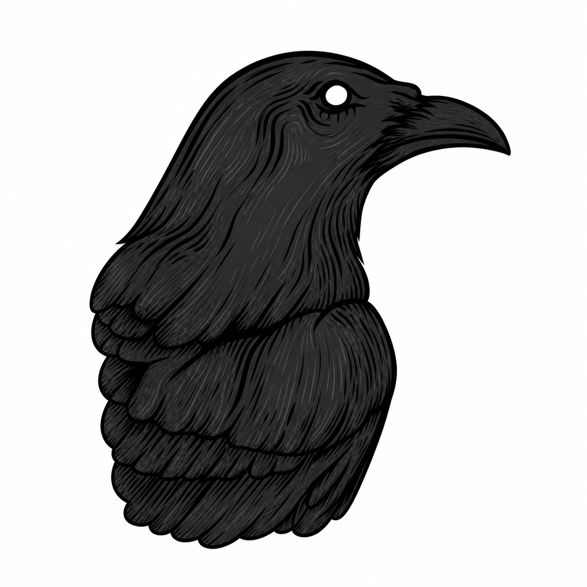

<p align="center">
  
</p>

<h1 align="center">coderaven</h1>

<p align="center">Run git-syncable code reviews on top of claude code locally 🚀</p>

`coderaven review` leverages claude code to run a structured AI review against the diff between your
current branch and its base, writes JSON findings to `.coderaven/reviews/`,
and serves a small web UI for triaging.

## Requirements

- Node.js 18+
- [Claude Code](https://claude.ai/code) installed and authenticated (`claude` on PATH)

## Installing coderaven

- Install dependencies:

  ```bash
  npm install -g coderaven
  ```

## Setting up locally

- Install dependencies:

  ```bash
  npm install
  ```

- Compile TypeScript sources to `dist/`:

  ```bash
  npm run build
  ```

- Symlink the `coderaven` binary onto your global `PATH` so you can invoke it from any repo:

  ```bash
  npm link
  ```

## Usage

- To review `HEAD` against the auto-detected base branch (`origin/main`, `origin/master`, then local fallbacks):

  ```bash
  coderaven review
  ```

- To review against a specific base branch instead of the auto-detected one:

  ```bash
  coderaven review --base develop
  ```

- To run a review without auto-opening the viewer in your browser:

  ```bash
  coderaven review --no-open
  ```

- To start the viewer in the foreground (useful for debugging or when you don't want a background process):

  ```bash
  coderaven serve
  ```

- To stop the background viewer started by a previous `coderaven review`:

  ```bash
  coderaven stop
  ```

The first `coderaven review` call starts a background viewer on port 6677 and
opens in the browser. Subsequent runs reuse the same viewer.

## Output format

Reviews are stored as `.coderaven/reviews/<branch>-<unix>.json`:

```json
{
  "id": "1715126400",
  "branch": "feat/auth",
  "baseBranch": "main",
  "commit": "abc1234",
  "createdAt": "2026-05-08T18:30:00Z",
  "comments": [
    {
      "id": "c_a1b2c3",
      "filepath": "src/auth.ts",
      "lineStart": 42,
      "lineEnd": 45,
      "severity": "warning",
      "category": "bug",
      "message": "...",
      "suggestedCode": "...",
      "resolved": false,
      "replies": []
    }
  ]
}
```

Resolves and replies mutate the file in place. Commit `.coderaven/reviews/`
to share review state with teammates; `.coderaven/.server.pid` is gitignored.

## Custom review rules

Create `.coderaven/config.json`:

```json
{
  "extraRules": "Flag any direct DB access from controllers. Require error wrapping for fs calls."
}
```

These are appended to the review prompt.
